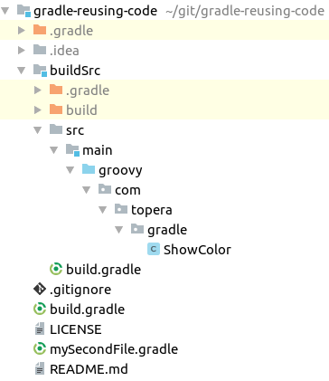

# Topera's Hello World #019
## Reusing classes in Gradle files
This hello world shows how to reuse vars (global vars) and classes in Gradle files.

## How to download this source code
* Install [Gradle](https://gradle.org/install)
* Use the `Clone or download` button above the get the url of this repository
* In IntelliJ IDEA: File → New → Project From Version Control → Git → put the url of this repository

## How to test
* Run `$ gradle showRed`

## Explanation
* We can split the main build.gradle file using a second file, like `mySecondFile.gradle`, using the `apply from` command
* We created a global variable using the variable `ext.` in `build.gradle` file
* File `mySecondFile.gradle` defines 2 custom tasks: showRed and showBlue.
    * Both are of type `ShowColor`, a custom class created by us in folder `buildSrc/src/main/groovy/com/topera/gradle/ShowColor.groovy`
* When we run `showRed` the log displays:
    <pre>
    > Configure project :
    [COLORS] Configuring task red
    [COLORS] Configuring task blue

    > Task :showRed
    [COLORS] Running task red
    My color is red
    </pre>
* There are 2 diff steps in Gradle. One for configuration, ran all the time: 'Configuring task red', 'Configuring task blue'. And another for the specific task called, in this case, red.

## Tech Stack
* Intellij IDEA 2018.1
* Gradle 4.8

## Folder Structure

To take a look in other projects, please see https://github.com/topera/index

